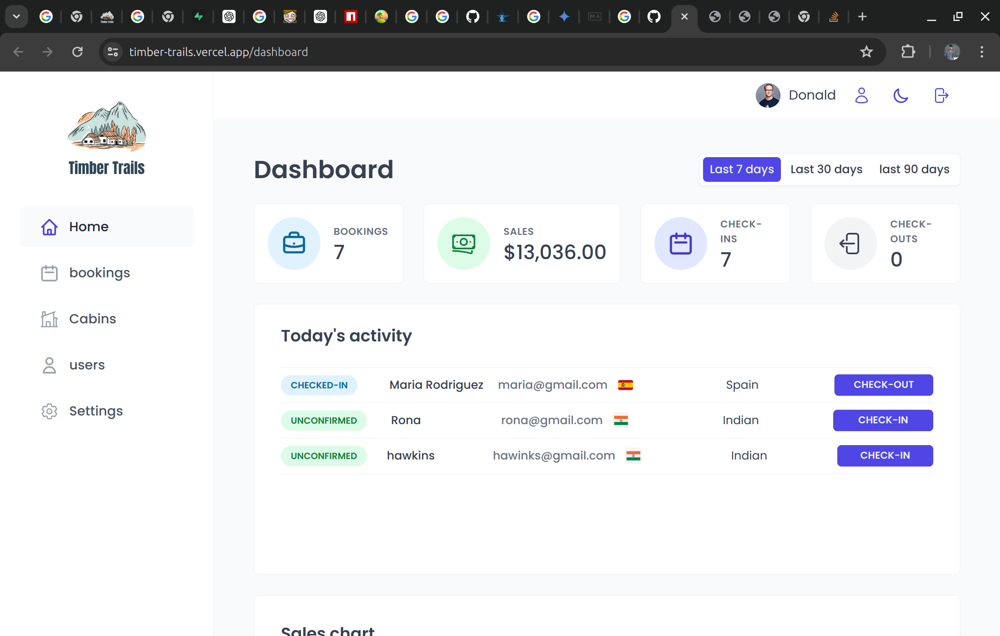

# **Timber Trials: Internal Hotel Management Application**

#### Welcome to Timber Trials, the comprehensive solution for hotel management designed to streamline and modernize operations for hotel owners. This application boasts a suite of features to efficiently manage bookings, cabins, user roles, check-ins, check-outs, and much more.

## **Images**

## **Dashboard-image**

## **Features**

### **Secure Login**: Robust authentication system ensuring secure access.

### **User Management**: Admins can create and manage users with various roles.

## **Admin Capabilities**

### **User Creation**: Admins can easily create new users and assign roles.

### **Cabin Management**: Create and update cabin details, including maintenance tracking.

### **Booking Management**: Manage bookings with functionalities for check-ins, check-outs, cancellations, and modifications.

## **Booking Management**

### **Pagination and Sorting**: Efficiently handle large sets of booking data with server-side pagination and sorting.

### **Client-Side Sorting**: Intuitive client-side sorting for a better user experience.

### **Prefetching Data**: Enhance performance with prefetching strategies for data.

## **Visual and Analytical Tools**

### **Beautiful Charts**: Generate visually appealing charts for data analysis.

### **Line Charts**: View today’s activity and other metrics through interactive line charts.

### **Custom Reports**: Generate detailed reports on bookings, revenue, and guest statistics.

## User Interface

### **Dark Mode**: Modern dark mode for a comfortable viewing experience.

### **Real-Time Updates**: Ensure the application reflects the latest data without refreshing.

## Additional Modern Features

### **API Level Sorting**: Enhance data handling with efficient API level sorting.

### **Logout**: Securely log out from the application to protect user sessions.

# **Technical Specifications**

## **Tech Stack**

### **Frontend**: React.js for a dynamic user interface.

### **Database**: Supabase for a scalable and real-time database solution.

### **Global** Remote State: React Query for managing global remote state.

### **Form Validation**: React Hook Form for efficient form validation.

### **Notifications**: React Hot Toast for customizable and responsive notifications.

### **Date Formatting**: date-fns for flexible and comprehensive date formatting.

### **Global UI State Management**: React Context API for managing global UI state.
